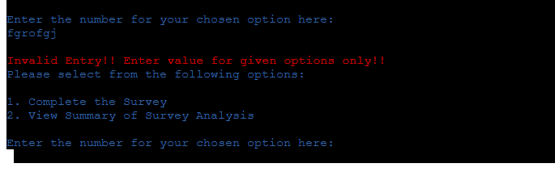

# Portfolio Project 3 - Electric Car Survey README
## 1. Purpose of the Project

This project creates an application for the collection and recording of survey information relating to electric cars through a presentation of survey questions, a choice of answers, and input fields to enter the participants' chosen answers. The purpose of the survey is to gain insight into the participants' attitudes toward electric cars including the advantages and disadvantages they perceive regarding the technology. This information would be of use in a number of fields.

Firstly, it could be used in by those working in government and the public service to inform policy. For example, if a government has made the key decision to promote the purchasing of electric cars, the information collected may help identify the financial, educational, or other key points that would need to be addressed by such a public policy and its promotion.

Information gathered may also be of some use to those involved in the design and manufacture of electric cars. As an example, if it was determined that cost was a key factor, the industry could look at the manufacture of smaller, cheaper, car models.

Finally, the information could be useful in the advertising and sale of electric vehicles. For example, if vehicle range was an issue of concern, then advertising and promotion could focus in on the real world ranges now achieved by the cars and the actual real-world driving distances generally required by most drivers. The perceptions and the reality may not match and the advertising could address this, if this was found to be the case as a result of the survey.

In addition to the above, it should be noted that the application has been designed so that it is easy to reduce or extend the number of questions or change the questions and answers via the google sheet containing the data. Therefore, in addition to conducting this specific survey, this application can quiet easily be adapted to the rolling out of a survey on any topic via the editing of the google sheet containing the questions and possible answers.

## 2. User Stories

1. As a visiting user, I would like to be able to complete the Electric Car Survey.
2. As a visiting user, I would like to be able to view a summary of the survey analysis to date.

## 3. Features

Please note that the features section contains relevant extracts from the project wireframes. The complete wireframes are included in section 7 of this document.

### 3.1 Survey Introduction

* The introduction welcomes the user to the survey.

* It provides the user with an option to complete the survey or to view the survey analysis.

Fig. 3.1.1 Survey Introduction

### 3.2 Survey Summary

* The Survey Summary provides a brief outline of what the survey is about.

* The participant is asked whether they wish to continue and can enter yes(Y) or no(N).

Fig. 3.2.1 Survey Summary

### 3.3  Survey Questions

* Firstly a question number and question are presented. The application gets the question from the associated worksheet. The question is formatted in the worksheet using the # symbol to ensure it fits neatly in the terminal window.

* The answer choices and their associated numbers are presented underneath the question.

* An input line is provided to receive the user inputted answer choice.

* The background worksheet format allows for one question and its associated answers per column. Row one contains a heading with the question number. Row 2 contains the question. Subsequent rows contain any number of potential answer choices to be presented to the user.

* Once the participant has answered a question the application will ask the next question.

* While the project currently contains 6 questions, any number of questions can be added via the worksheet, with a varying number of potential answers, without altering the code as long as the worksheet format is maintained.

Fig. 3.3.1 Sample Survey Question

### 3.4 Survey Conclusion

* After the final question is answered the application saves the survey data and updates the overall survey analysis based on these most recent answers.

* While this process is underway the user is presented with progress messages to keep them informed.

* Once completed the user is informed and thanked for their participation.

Fig. 3.4.1 Survey Conclusion Message

### 3.5 Summary of Survey Analysis

* If option 2 is selected in the Survey Introduction the application prints the survey analysis to the screen.

* This displays the questions asked, together with the percentage of participants to opt for each potential answer to each question asked.

Fig. 3.5.1 Survey Analysis Presentation Template

## 4. Flow Chart

Based on the user stories and the features outlined above the flow chart below was developed to outline the required program logic and so inform the code and function design. The flow chart was developed using Lucidchart https://www.lucidchart.com

#### Fig 4.1 Flow Chart

## 5. Future Features

The following features could be added in time.

1. An additional option could be made available to the entity creating the survey to allow proposed survey questions and answers be entered via the application itself rather than the spreadsheet.

2. All manor of additional analysis could be provided. For example, what percentage of people giving answer x to question y also gave answer a to question b etc. There are endless possibilities here and the analysis would likely need to be customised depending on the questions asked.

3. It would also be possible to use the google sheet to carry out some of the analysis and then simply get the results from the appropriate worksheet rather than running large calculations in the background of the application itself.

## 6. Color Scheme

* Colorama has been used to add a simple color scheme to the text output.

* Error Messages that result from invalid input entries are printed in red.

* Otherwise a combination of green, blue, cyan, and the standard white text are used to contrast different elements of text so as to make the displayed output easier to read.

## 7. Wireframes

### 7.1 Survey Introduction and Survey Summary

### 7.2 Survey Questions 1 & 2

### 7.3 Survey Questions 3 & 4

### 7.4 Survey Questions 5, 6 and Thank You message.

### 7.5 Survey Analysis Template

## 8. Technology

The following technologies were used in developing and deploying the website:

* Python

* Google Sheets

* Google Drive

* Google Cloud

* Google Sheets API

* Google Drive API

* gspread Python library

* google-auth Python library

* colorama Python library

* HTML, CSS and Javascript are included in the Code Institute Python Template used to aid deployment of this project to Heroku.

* The IDE used was GITPOD

* The repository used is GITHUB

* The website is deployed on Heroku.

* Balsamiq was used to prepare wireframes.

* Lucidchart was used to prepare the logic flow chart.

* Google Chrome was used as the main web browser both for accessing the IDE and the repository as well as to view the application on Heroku during development.

## 9. Testing

   ### 9.1 Code Validation

The python code was tested using both the pylint command in the IDE terminal and the Code Institute Python Linter available at https://pep8ci.herokuapp.com/. The python code successfully passed validation:

#### Fig 9.1.1 IDE Python Linter

#### Fig 9.1.2 Code Institute Python Linter

### 9.2 Test Cases

 #### 9.2.1 User Story 1

As a visiting user, I would like to be able to complete the Electric Car Survey.

This requirement is met by the provision of an option in the opening message to complete the survey. Upon selecting this option the user is led through the process to complete a survey.

This process has certain requirements tested as follows:

Feature/Operation|Expect|Action|Result
---|---|---|---
Welcome Message|Welcome message to appear on start-up|Ran the program|Welcome message appeared
Enter Invalid option|Warning message to appear and options to be presented again|Entered invalid entry 3|Warning message appeared and options were presented again
Enter Invalid option|Warning message to appear and options to be presented again|Entered invalid entry fgrofgj|Warning message appeared and options were presented again
Enter Option 1 to complete the survey|Survey Summary message to appear on screen|Entered 1|Survey Summary message appeared on screen including option to continue or exit
Survey Summary shows the number of questions to be answered|Summary to say there are 6 questions|None - 6 questions previously entered to worksheet|Summary says there are 6 questions
Enter Invalid option to continue yes/no|Warning message to appear and options to be presented again|Entered invalid entry 3|Warning message appeared and options were presented again
Enter Invalid option to continue yes/no|Warning message to appear and options to be presented again|Entered invalid entry fgrofgj|Warning message appeared and options were presented again
Enter N to continue yes/no|Confirmation message to appear and program to end|Entered n|Confirmation message appears and program ends
Enter Y to continue yes/no|First question to appear on screen|Entered y|First question appeared on screen
Enter Invalid answer option|Warning message to appear with chance to enter option again|Entered invalid entry 7|Warning message appeared with chance to enter option again
Enter Invalid answer option|Warning message to appear with chance to enter option again|Entered invalid entry frgfergeta|Warning message appeared with chance to enter option again
Enter a valid answer option|Question 2 to appear|Entered 1|Question 2 appeared
For each subsequent question a valid answer is submitted|Next question to appear|Continued to enter valid answers|Next question appeared each time
Enter valid answer to final question|User updates regarding background processing to appear followed by thank you message|Entered valid answer to final question|User updates regarding background processing appeared followed by thank you message
Saving responses|The responses entered by the survey participant to be appended to the last row of the appropriate worksheet. (This is not visible to the user)|Entered answers as follows to each of the six questions: 2, 3, 1, 4, 5, 2|The responses entered are appended to the last row of the appropriate worksheet.(See fig. 9.2.1.7)

Fig. 9.2.1.1 Welcome Message

Fig. 9.2.1.2 Invalid Message

Fig. 9.2.1.3 Survey Summary Message

Fig. 9.2.1.4 Survey Exit Message

Fig. 9.2.1.5 First Question

Fig. 9.2.1.6 User Processing Updates and Thank You Message

Fig. 9.2.1.7 Responses Worksheet

#### 9.2.2 User Story 2

As a visiting user, I would like to be able to view a summary of the survey analysis to date.

This requirement is met by the provision of an option in the opening message to view a summary of the survey analysis. Upon selecting this option the latest survey analysis is displayed to screen.

This process has certain requirements tested as follows:

Feature/Operation|Expect|Action|Result
---|---|---|---
Enter 2 to view summary of survey analysis|Summary of Survey Analysis to appear on screen|Entered 2 at the welcome message options|Summary of Survey Analysis appeared on screen.
Survey Analysis|Survey data displayed to match stats worksheet (Worksheet not visible to the user)|Compare worksheet to screen data|Survey data displayed matches stats worksheet (See Fig 9.2.2.1 and Fig 9.2.2.2 for comparison of sheet and displayed Question 1 data as an example.)

Fig. 9.2.2.1 Survey Analysis for Question 1

Fig. 9.2.2.2 Stats Worksheet

## 10. Deployment

   ### 10.1 via github

1. The Code Institute python essentials project template was accessed on github at https://github.com/Code-Institute-Org/python-essentials-template and the Use this Template button clicked was to create a project-specific repository.

2. All files and documents pushed from Gitpod appear in the repository.

   ### 10.2 via gitpod

The site was developed in gitpod as follows:

1. From the github repository created for the project the Gitpod button installed as a chrome browser extension was clicked. A Gitpod workspace was created.

2. To view the ongoing development in the terminal, the command python3 run.py was entered in the IDE terminal.

3. At regular appropriate intervals the latest version of the code was saved via the git add and git commit commands. Appropriate commit messages were added to control the revisions.

4. The git push command was used to push all committed code and documentation to the repository for secure storage.

   ### 10.3 via Heroku

* The application is deployed to Heroku in the form of a web page with a mock terminal interface. This page is created by code in the python essentials template provided by Code Institute.

* Prior to deployment the requirements.txt file is updated by typing the command pip3 freeze > requirements.txt to the terminal and following this all outstanding commits are pushed to the github repository.

* In Heroku a new project is created to host the application.

* Within this project in the settings section the Config Vars area is updated by adding the following:

1. A key named CREDS is created and the full creds.json file content is copied into this as the value.

2. A key named PORT is created and it is given the value 8000.

* Within the project settings area two buildpacks are added in the following order:

1. python

2. nodejs

* In the Deploy section the option to connect to github is chosen, the repository name is found and clicked on.

* The option to deploy from the main branch is chosen and the project is deployed. This may take a few moments.

* Once deployed a button linking to the site is provided. When clicked it leads to the deployed application and the page address can be copied and provided as a link to the site/application.

* The live site/application can be accessed <a href="https://mf-pp3-electric-car-survey.herokuapp.com/" target="_blank">here</a>

## 11. Credits

* Code Institute for the Gitpod python essentials template provided at https://github.com/Code-Institute-Org/python-essentials-template allowing easy set up of a repository and workspace as well as creating the mock terminal when deploying to Heroku.

* Code Institute Love Sandwiches example project for general guidance as to minimun requirements and overview of approach and industry conventions. In particular for guidance on the process and code needed to connect this python application to a Google Sheet including using APIs from Google Cloud, adding python libraries to the workspace and importing libraries to run.py.

* w3schools - www.w3schools.com for information on various python methods including the .split() method.

* Code Institute Battleships Project and README example for minimun requirements.

* edureka|Community at www.edureka.co for information on raise SystemExit().

* geeksforgeeks.org for information on sum(), max() and index() functions.

* gspread Documentation Release 5.7.0 by Anton Burnashev, Nov 13 2022 obtained from https://buildmedia.readthedocs.org for information on .update_cell()

* Fellow students in the KCETB-Code Institute cohort for the feedback, advice, and, constant discussion of all things code.

* Ms. Irene Neville, Code Institute cohort facilitator, for the provision of or signposting towards all key pieces of information needed to ensure the successful completion of the project to the required standards.

* Mr. Rohit Sharma (Mentor) for guidance on overall project approach, industry standards and, README requirements. Also for specific signposting toward the colorama library and for advice on the use of "if __name__ == '__main__':" as good practice at the point of calling the main() function in run.py to check on file hierarchy.
